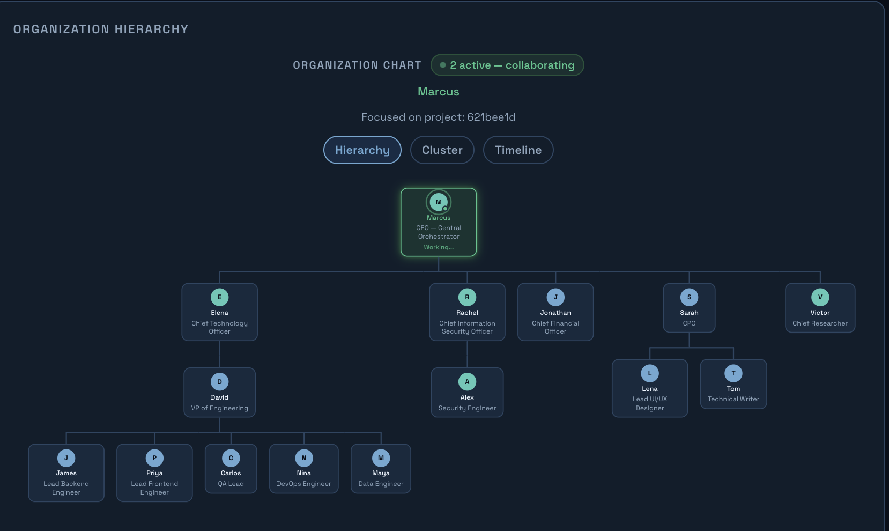
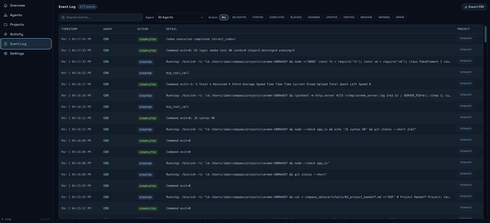
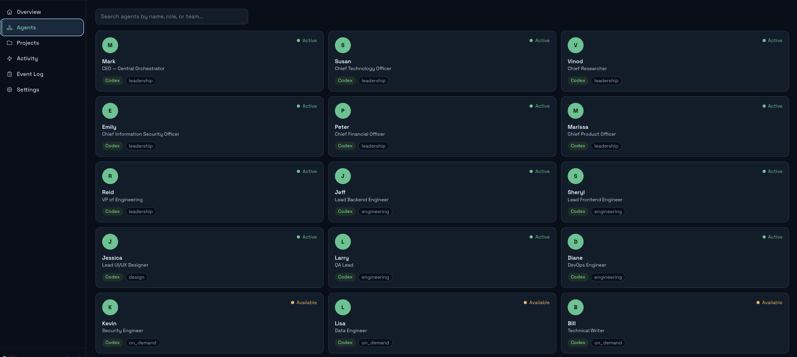
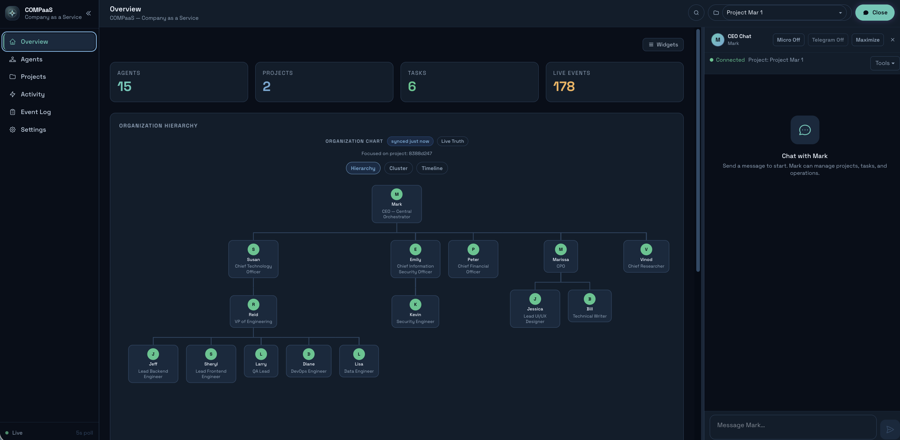

# COMPaaS

**Company as a Service.**
Run a full AI software company from one command center.

COMPaaS turns one operator into an execution team with leadership, engineering, design, QA, security, and documentation built in. You define direction. COMPaaS plans, delegates, builds, validates, and hands work back with clear run instructions.

## Why COMPaaS

Most AI tools generate isolated answers.
COMPaaS runs coordinated execution.

With COMPaaS, you get:

- CEO-led orchestration instead of disconnected prompts
- A 15-agent virtual org that collaborates on real deliverables
- Project-scoped planning, implementation, validation, and handoff flow
- Live visibility into what is happening right now
- Local and GitHub delivery modes
- Optional deployment and chat integrations

## Screenshots

### Organization Tree


### Event Log


### Agents


### CEO Chat


## 60-Second Quick Start

```bash
bash <(curl -fsSL https://raw.githubusercontent.com/comp-a-a-s/compaas/master/bootstrap.sh)
```

## First Run Flow

1. Start COMPaaS with `compaas-web`
2. Open [http://localhost:8420](http://localhost:8420)
3. Create or select a project
4. Message your CEO in chat with the outcome you want
5. Review structured completion output with run commands and links

## Core Capabilities

### CEO Orchestration

- Structured completion summaries
- Clear run commands and open links
- Delegation visibility for each stage
- Transparent raw response toggle when needed

### Project Delivery System

Each project is tracked through:

- Project description
- Team and high-level tasks
- Final run commands

### Live Operations Visibility

- Organization tree with active collaboration
- Workforce and agent activity tracking
- Event log for execution traceability

### Integrations

- GitHub for repository delivery
- Vercel for deployment workflow
- Telegram for chat mirroring

## Installation

### Option A (Recommended)

```bash
bash <(curl -fsSL https://raw.githubusercontent.com/comp-a-a-s/compaas/master/bootstrap.sh)
```

### Option B (Existing Checkout)

```bash
./install.sh
```

### Option C (Manual)

```bash
python3 -m venv .venv
source .venv/bin/activate
pip install -e ".[dev,local-models]"
```

```bash
cd web-dashboard
npm install
npm run build
cd ..
```

```bash
cp .env.example .env
pytest tests/ -v
```

## Run COMPaaS

### Web Dashboard

```bash
compaas-web
```

Default URL: [http://localhost:8420](http://localhost:8420)

## API and Runtime

- WebSocket chat: `/api/chat/ws`
- Chat history: `/api/chat/history`
- Workforce snapshot: `/api/workforce/live`
- Versioned APIs: `/api/v1/*`

## Configuration Highlights

| Variable | Default | Description |
|---|---|---|
| `COMPAAS_DATA_DIR` | `./company_data` | Runtime state directory |
| `COMPAAS_API_HOST` | `127.0.0.1` | Web host |
| `COMPAAS_API_PORT` | `8420` | Web port |
| `COMPAAS_CORS_ORIGINS` | localhost defaults | Allowed origins |
| `COMPAAS_CORS_METHODS` | `GET` | Allowed CORS methods |
| `COMPAAS_ADMIN_TOKEN` | unset | Optional admin write guard |

## Local Models (Complete Guide)

Running COMPaaS with local/self-hosted models is fully supported.

Full guide (all methods, model selection, install/pull steps, and troubleshooting):

- [Local Models Guide](docs/local-models-guide.md)

Included runtimes:

- Ollama
- LM Studio
- llama.cpp
- Jan
- vLLM
- Custom OpenAI-compatible servers

## Contributing

COMPaaS is actively evolving and contributions are welcome.

High-impact contribution areas:

- Agent quality and orchestration logic
- New tool adapters and integrations
- CEO chat UX and structured completion improvements
- Reliability, security, and test coverage
- Documentation and onboarding quality

### Contribution Workflow

1. Fork the repo
2. Create a branch
3. Add tests for behavior changes
4. Run:

```bash
pytest -q
cd web-dashboard && npm run build && npm run test:e2e:smoke
```

5. Open a pull request with a clear summary

## Troubleshooting

- `compaas-web` not starting: verify Python env and package install
- Dashboard build issues: run `cd web-dashboard && npm install && npm run build`
- Port conflict: `COMPAAS_API_PORT=9000 compaas-web`
- CORS write methods blocked: set `COMPAAS_CORS_METHODS=GET,POST,PATCH,DELETE`

## License

MIT. See [LICENSE](LICENSE).

## Final Word

If you want AI to operate like a real company instead of a chat toy, COMPaaS is the platform.

Use it. Ship with it. Improve it with us.
